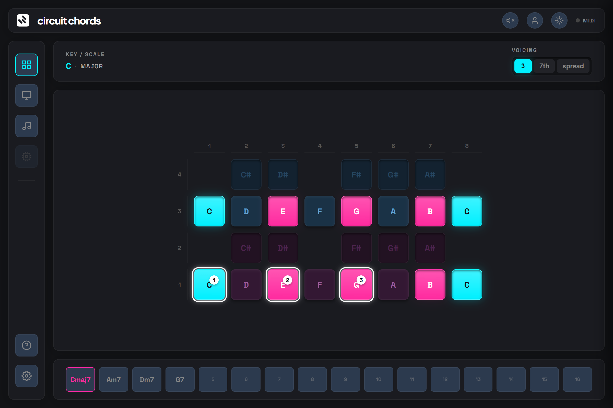

# Circuit Chords

Map chord progressions to playable pad voicings for Novation Circuit Tracks and Rhythm.



This is a Lit + Tonal.js web app that provides an interactive visualizer and editor:

- Parses chord progression text (example: `Am7 D9 Gmaj7`)
- Shows progression stepper for chord-by-chord selection
- Renders a 4x8 Circuit-style pad grid
- Supports **Chromatic** and **Scale Collapse** pad modes
- Supports voicing modes: `triad`, `seventh`, `spread`, and inversions
- Built-in internal audio engine for previewing chords in the browser
- **WebMIDI Integration**: Send patch sysex dumps, request patches, and change programs
- **Synth Patch Editor**: Full control over oscillators, mixer, filter, and envelopes
- Highlights target pads for current voicing (ring + step number)
- **Themes**: Switch between Circuit Tracks (Dark) and Circuit Rhythm (Light) aesthetics

## Tech Stack

- Lit (web components)
- Tonal.js (chord and scale logic)
- Tone.js (internal audio engine)
- Vite
- TypeScript

## Local Development

Install:

```bash
npm install
```

Run dev server:

```bash
npm run dev
```

Type check:

```bash
npm run typecheck
```

Production build:

```bash
npm run build
```

Preview build:

```bash
npm run preview
```

## GitHub Pages Deployment (Branch + /docs)

This repo is configured to output build files to `docs/`.

Vite config:

- `build.outDir = "docs"`
- `base = "/circuit-chords/"`

Deployment steps:

1. Run `npm run build`
2. Commit and push `docs/` output
3. In GitHub repo settings:
   - Pages Source: `Deploy from branch`
   - Branch: `main`
   - Folder: `/docs`

## UX Notes

- Main pad grid stays visible first to reduce scrolling.
- In `Scale Collapse`, non-scale chord tones may be hidden; app warns when this happens.
- Hardware state (WebMIDI) updates actively when connected.
