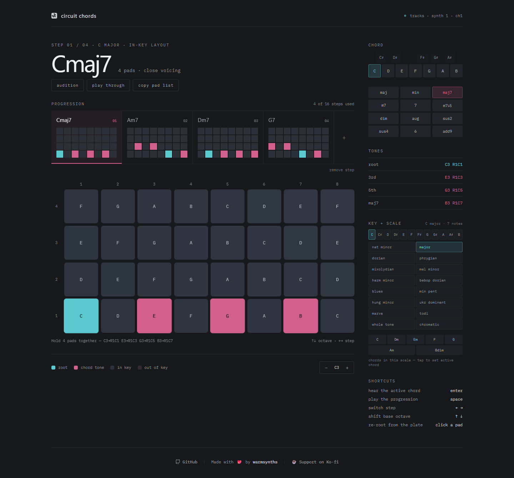

# Circuit Chords

[](https://www.gnu.org/licenses/gpl-3.0)
[](https://www.typescriptlang.org/)
[](https://lit.dev/)
[](https://vitejs.dev/)
[](https://vitest.dev/)

Map chord progressions directly to playable 8x4 pad voicings for **Novation Circuit Tracks** and **Circuit Rhythm**.



Circuit Chords is an interactive visualizer, progression sequencer, and voicing companion built specifically for Novation Circuit groovebox workflows. It removes the guesswork when converting complex chord ideas into physical finger positions on the Circuit's 32-pad grid.

---

## ✨ Features

### 🎛️ Hardware-Accurate 8x4 Pad Matrix
- **Exact 32-Pad Layout**: Renders the 4-row × 8-column pad plate with row (`1–4`) and column (`1–8`) coordinate indicators (e.g. `R1C1`, `R1C3`, `R1C5`, `R1C7`).
- **Layout Modes**:
  - **In-Key (Scale Collapse)**: Pads collapse to active scale intervals across rows.
  - **Chromatic**: 2-octave layout with natural lower rows and accidental upper rows.
- **Visual Color Coding**:
  - <span style="color:#5cc9d1">■</span> **Root Pad**: Highlighted in cyan.
  - <span style="color:#d1608f">■</span> **Chord Tones**: Highlighted in magenta.
  - <span style="color:#8094a6">■</span> **In-Key Pads**: Subtle blue-slate tint with ambient shimmer.
  - <span style="color:#594751">■</span> **Out-of-Key Pads**: Deep dark burgundy.
- **Off-Plate Tone Alerts**: Warns automatically if chord notes fall outside the current base octave register.
- **Interactive Pads**: Tap any pad on the plate to audition the pitch and re-root the current step.

### 🎼 Progression Sequencer & Stepper
- **1 to 16 Steps**: Build sequences up to the 16-step capacity of Novation Circuit Tracks patterns.
- **Live Mini-Grids**: Each step displays an active 8x4 thumbnail of its pad configuration.
- **Auto-Persistence**: Progression and session state are preserved automatically in browser `localStorage`.
- **Step Controls**: Add (`+`), remove, click or keyboard-navigate between steps seamlessly.

### 🎹 Deep Theory & Scale Engine
- **12 Root Notes**: Interactive piano keyboard input for instant natural and sharp/flat selection.
- **12 Chord Qualities**: `maj`, `min`, `maj7`, `m7`, `7`, `m7♭5`, `dim`, `aug`, `sus2`, `sus4`, `6`, `add9`.
- **All 16 Hardware Scales**: Native support for all Circuit Tracks scales in hardware order:
  - *Natural Minor, Major, Dorian, Phrygian, Mixolydian, Melodic Minor, Harmonic Minor, Bebop Dorian, Blues, Minor Pentatonic, Hungarian Minor, Ukrainian Dominant, Marva, Todi, Whole Tone, Chromatic*.
- **Scale Chords / Diatonic Chips**: Generates diatonic chords for the active key and scale with Roman numeral analysis (`I`, `ii`, `iii`, `IV`, `V`, `vi`, `vii°`) for rapid chord substitution and discovery.
- **Tones Breakdown Table**: Exact interval degrees (`root`, `3rd`, `♭3rd`, `5th`, `♭5th`, `maj7`, `♭7th`, `9th`), note names, and plate coordinates.

### 🔊 Built-in Web Audio Dual-Oscillator Synth
- Instant zero-dependency browser synthesis powered by the Web Audio API.
- Warm dual-oscillator architecture (Triangle + detuned Sine) fed through a 2.6 kHz lowpass filter with gentle exponential envelopes.
- **Audition**: Hear single chords on demand (`Enter`).
- **Play Through**: Sequence through the entire progression with automated transport timing (`Space`).

### 📋 Productivity & Quick Reference
- **One-Click Pad List Copy**: Exports chord definitions and pad coordinates to your clipboard (e.g. `Cmaj7 — C3→R1C1  E3→R1C3  G3→R1C5  B3→R1C7`).
- **Octave Transposition**: Shift base octave up and down (`C2`–`C5`) with live coordinate re-calculation.

---

## ⌨️ Keyboard Shortcuts

| Shortcut | Action |
| :--- | :--- |
| <kbd>Enter</kbd> | Audition the active chord |
| <kbd>Space</kbd> | Play / stop progression sequence |
| <kbd>←</kbd> / <kbd>→</kbd> | Switch active progression step |
| <kbd>↑</kbd> / <kbd>↓</kbd> | Shift base octave up / down |
| **Click Pad** | Audition note & re-root chord from the pad |

---

## 🛠️ Tech Stack

- **[Lit](https://lit.dev/)**: Lightweight, performant Web Components
- **[Tonal.js](https://github.com/tonaljs/tonal)**: Music theory, chord parsing, and scale interval logic
- **[Web Audio API](https://developer.mozilla.org/en-US/docs/Web/API/Web_Audio_API)**: Dual-oscillator synthesizer engine
- **[Vite](https://vitejs.dev/)**: Fast dev server and optimized production bundler
- **[TypeScript](https://www.typescriptlang.org/)**: Strictly typed code and musical structures
- **[Vitest](https://vitest.dev/)**: Unit testing suite (187 passing tests)

---

## 🚀 Getting Started

### Prerequisites
- Node.js 18+ and npm

### Installation
```bash
git clone https://github.com/warmsynths/circuit-chords.git
cd circuit-chords
npm install
```

### Development Server
```bash
npm run dev
```
Open `http://localhost:5173/` in your browser.

### Run Tests
```bash
npm test
```

### Type Check
```bash
npm run typecheck
```

### Production Build
```bash
npm run build
```
The optimized bundle is output to `docs/` for seamless GitHub Pages hosting.

### Preview Production Build
```bash
npm run preview
```

---

## 🌐 GitHub Pages Deployment

The repository is configured to deploy directly from the `/docs` folder on the `main` branch.

1. Build the production application:
   ```bash
   npm run build
   ```
2. Commit and push the updated `/docs` directory to `main`.
3. In GitHub repository settings:
   - **Settings** → **Pages**
   - **Source**: `Deploy from branch`
   - **Branch**: `main`
   - **Folder**: `/docs`

---

## 📄 License

This project is licensed under the **GNU General Public License v3.0** - see the [LICENSE](LICENSE) file for details.

---

## 💖 Community & Support

- Created with 💖 by [warmsynths](mailto:warmsynthsiloveyou@gmail.com)
- [GitHub Repository](https://github.com/warmsynths/circuit-chords)
- [Support on Ko-fi](https://ko-fi.com/warmsynths)

